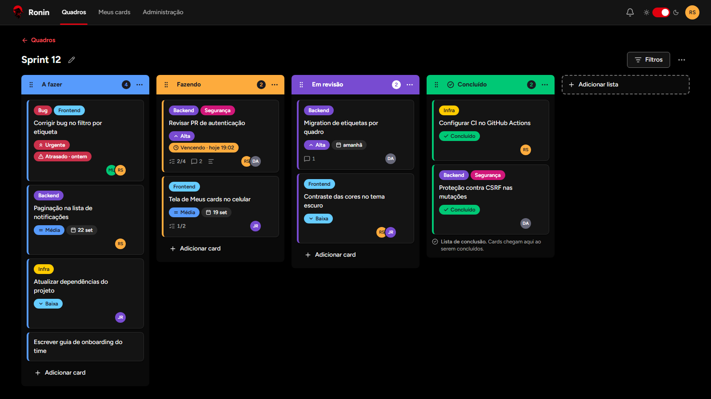
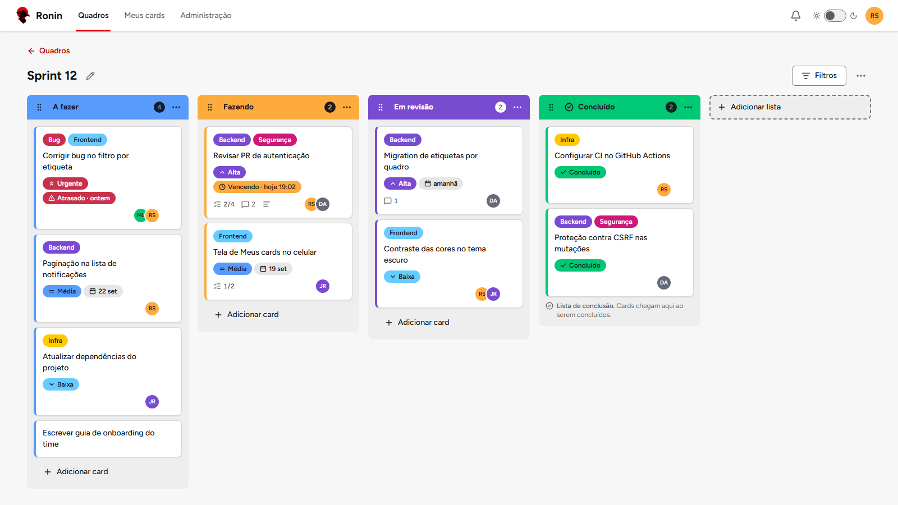
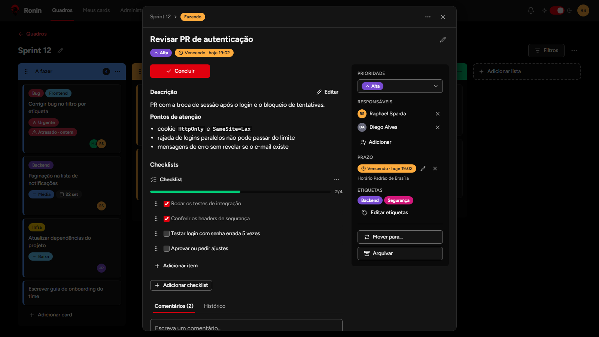
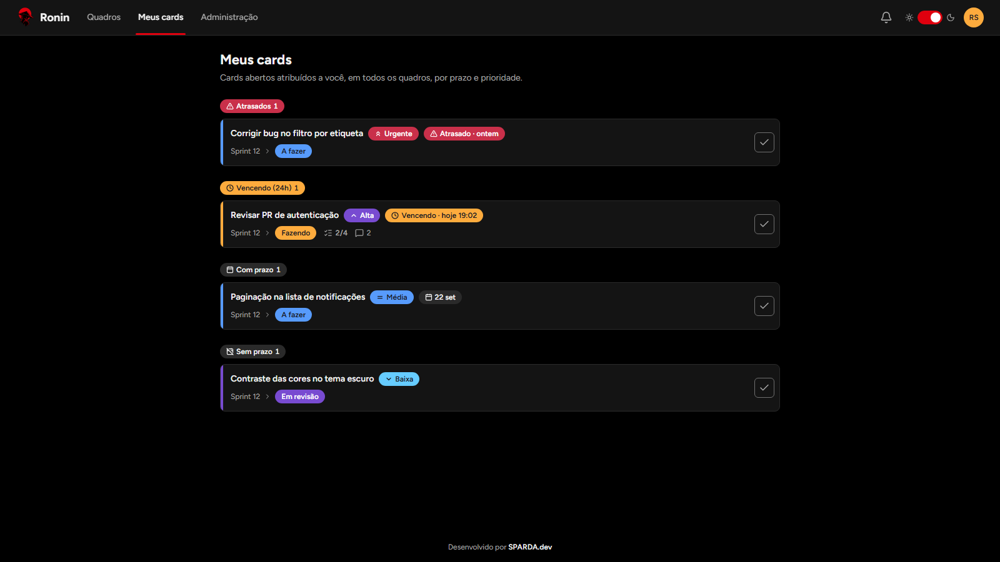
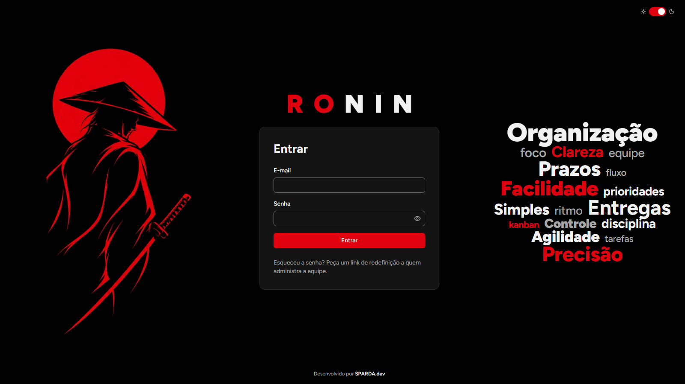
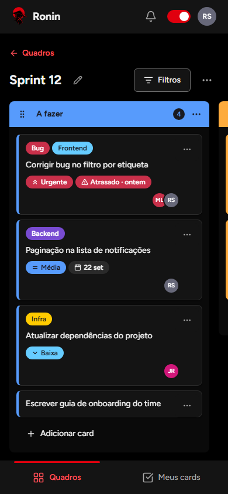

# Ronin Web

**Quadros de tarefas coloridos, rápidos e acessíveis para equipes pequenas.**

[](https://github.com/raphasparda/Ronin-front/actions/workflows/ci.yml)


> **English summary.** Web client for Ronin, a self-hosted, board-based task manager for small teams, in the spirit of Trello and ClickUp. Built with React 19, TypeScript, Vite, TanStack Query and Tailwind CSS 4. Highlights: drag-and-drop with a keyboard-friendly "Move to…" alternative, optimistic updates with per-item rollback and mutation queues, filters stored in the URL, safe Markdown, light and dark themes, page transitions with the View Transitions API, and WCAG 2.2 AA checks with axe in the end-to-end suite. The API lives in [Ronin-End](https://github.com/raphasparda/Ronin-End). Documentation is in Brazilian Portuguese.

O Ronin é um app de tarefas em quadros, no estilo Trello e ClickUp, para uma equipe pequena rodar no próprio servidor. Este repositório tem a **SPA em React**. A API, o banco e os contratos compartilhados ficam em [raphasparda/Ronin-End](https://github.com/raphasparda/Ronin-End).

Público deste README: quem avalia, roda ou desenvolve o front do projeto.

## Sumário

- [Telas](#telas)
- [Funcionalidades](#funcionalidades)
- [Destaques técnicos](#destaques-técnicos)
- [Stack](#stack)
- [Como rodar](#como-rodar)
- [Scripts](#scripts)
- [Testes](#testes)
- [Estrutura do projeto](#estrutura-do-projeto)
- [Documentação](#documentação)
- [Autor](#autor)

## Telas

Capturas geradas com o próprio app, rodando com dados de exemplo.

**Quadro no tema escuro**



**Quadro no tema claro**



<table>
  <tr>
    <td width="50%"><strong>Detalhe do card</strong><br /></td>
    <td width="50%"><strong>Meus cards</strong><br /></td>
  </tr>
  <tr>
    <td width="50%"><strong>Login</strong><br /></td>
    <td width="50%" align="center"><strong>Celular</strong><br /></td>
  </tr>
</table>

## Funcionalidades

- **Quadros e listas com cor** de uma paleta fixa, e uma lista marcada como "Concluído".
- **Arrastar e soltar** listas, cards e itens de checklist com `@dnd-kit`.
- **"Mover para…"** (quadro, lista e posição) como alternativa completa ao arraste, pelo teclado e no celular.
- **Detalhe do card** em diálogo com URL própria: título, descrição em **Markdown seguro**, histórico de atividade.
- **Responsáveis, etiquetas, prazo e prioridade** (Baixa, Média, Alta, Urgente), com estados "vencendo" e "atrasado". Nenhuma informação depende só da cor.
- **Filtros na URL** por responsável, etiqueta, prioridade, prazo e texto: o link filtrado pode ser compartilhado.
- **Checklists** com progresso na face do card e **comentários** em Markdown.
- **Notificações** no app quando alguém atribui você a um card ou comenta num card seu.
- **Meus cards**: tudo o que é seu, em todos os quadros, agrupado por prazo e ordenado por prioridade.
- **Tema claro e escuro** com as cores da logo, aplicado antes da primeira pintura (sem piscar).
- **Transições entre telas no estilo iOS** (entrar, voltar, trocar de seção) com a View Transitions API, e **animações "bubble"** em diálogos, menus e cards novos. "Reduzir movimento" desliga tudo.
- **Responsivo**, com navegação inferior no celular.
- **Acessibilidade WCAG 2.2 AA**: navegação completa por teclado, foco visível, rótulos em ícones e axe nos testes E2E, nos dois temas.
- **Administração**: convites e redefinição de senha por link, papéis, desativação e anonimização de membros.

Escopo completo do produto: `docs/product/scope.md` no [ronin-api](https://github.com/raphasparda/Ronin-End/blob/main/docs/product/scope.md).

## Destaques técnicos

- **Atualizações otimistas com rollback por item** (TanStack Query 5): mover, concluir ou editar um card aparece na hora. Se a API recusar, só os campos daquele card voltam, sem desfazer as outras ações em andamento ([`src/features/cards/cards-api.ts`](src/features/cards/cards-api.ts)).
- **Filas de mutação** por escopo (`scope` do TanStack Query): movimentos seguidos no mesmo quadro são enviados em ordem, e o quadro só é recarregado quando a fila esvazia.
- **Contratos compartilhados**: tipos e schemas Zod vêm do pacote `@raphasparda/ronin-shared`, o mesmo que a API usa. Os testes de componentes usam MSW com as mesmas fixtures.
- **Design system tokenizado no Tailwind 4**: tokens semânticos (`--color-surface`, `--color-text`, ...) e de paleta por tema em `@theme`, sem cores literais nos componentes ([`src/styles/globals.css`](src/styles/globals.css), [`docs/design/design-system.md`](docs/design/design-system.md)).
- **Segurança no cliente**: o redirecionamento pós-login (`?next=`) aceita só caminhos internos ([`src/lib/safe-next.ts`](src/lib/safe-next.ts)); o Markdown é renderizado sem HTML cru e sem links `javascript:` ([`src/components/ui/Markdown.tsx`](src/components/ui/Markdown.tsx)); toda mutação envia o header de CSRF que a API exige.
- **Transições de página** calculadas pela profundidade da rota (push, pop, fade), sobre `viewTransition` do React Router ([`src/lib/page-transitions.ts`](src/lib/page-transitions.ts)).
- **E2E contra a API real**: o Playwright sobe a API do ronin-api num banco isolado (`kanban_e2e`), em portas próprias, e roda em desktop e celular, com checagem de acessibilidade por axe.

## Stack

| Camada      | Tecnologia                                                      |
| ----------- | --------------------------------------------------------------- |
| UI          | React 19, TypeScript 5.9, React Router, lucide-react            |
| Build       | Vite 8                                                          |
| Estilo      | Tailwind CSS 4 com tokens próprios, fonte Figtree               |
| Dados       | TanStack Query 5, contratos Zod 4 (`@raphasparda/ronin-shared`) |
| Formulários | React Hook Form                                                 |
| Arraste     | `@dnd-kit/core` e `@dnd-kit/sortable`                           |
| Markdown    | `react-markdown` + `remark-gfm`, sem HTML                       |
| Testes      | Vitest + Testing Library + MSW; Playwright + axe                |
| Qualidade   | ESLint, Prettier, GitHub Actions                                |

## Como rodar

**Pré-requisitos:** Node.js 24 e pnpm 10 (`npm i -g pnpm@10`). Não precisa de Docker nem de PostgreSQL instalado. Os comandos funcionam no PowerShell (Windows), no Linux e no macOS.

Este repositório **precisa do ronin-api na pasta ao lado**: o pacote de contratos vem de `link:../ronin-api/packages/shared`, e o Vite faz proxy de `/api` para a API local.

1. Clone os dois repositórios lado a lado, com estes nomes de pasta:

   ```powershell
   git clone https://github.com/raphasparda/Ronin-End.git ronin-api
   git clone https://github.com/raphasparda/Ronin-front.git ronin-web
   ```

2. Suba a API no primeiro terminal (banco local na 5433, migrations e API na 3000):

   ```powershell
   cd ronin-api
   pnpm install
   pnpm dev
   ```

3. Suba o web no segundo terminal:

   ```powershell
   cd ronin-web
   pnpm install
   pnpm dev
   ```

4. Abra <http://127.0.0.1:5310>. Com o banco vazio, a primeira tela é **Configurar a equipe**: a primeira conta vira Admin. Convites e redefinição de senha: seção "Primeiro uso" do [README do ronin-api](https://github.com/raphasparda/Ronin-End#como-rodar).

Detalhes:

- A porta do web é fixa em **5310** (`strictPort`): se estiver ocupada, o Vite falha em vez de trocar de porta.
- O Vite faz proxy de `/api` para `http://127.0.0.1:3000` (ou o `PORT` do `.env` do ronin-api).
- Se abrir `http://localhost:5310`, o servidor redireciona para `http://127.0.0.1:5310`: a API só aceita mutações com `Origin` igual ao `APP_ORIGIN`.

**Variáveis** (todas opcionais, em [`.env.example`](.env.example); copie para `.env`):

- `RONIN_API_DIR`: pasta do ronin-api (padrão `../ronin-api`). Se mudar, ajuste também o `link:` do `package.json`.
- `API_PROXY_TARGET`: alvo do proxy `/api`.
- Só nos E2E: `E2E_API_PORT` (3100), `E2E_WEB_PORT` (5320), `E2E_DATABASE_URL`.

Problemas comuns: [`docs/ops/setup-local.md`](docs/ops/setup-local.md) e [`docs/ops/known-issues.md`](docs/ops/known-issues.md).

<details>
<summary><strong>Usar o pacote de contratos publicado (GitHub Packages)</strong></summary>

- **Local (padrão):** `"@raphasparda/ronin-shared": "link:../ronin-api/packages/shared"`. Vite, Vitest e `tsc` leem a fonte TypeScript do ronin-api; uma mudança lá aparece aqui na hora.
- **Registro:** troque para `"@raphasparda/ronin-shared": "^0.1.0"`. O `.npmrc` deste repositório já aponta o escopo para `https://npm.pkg.github.com`. Falta só um token com `read:packages` no `~/.npmrc` de usuário (`//npm.pkg.github.com/:_authToken=<PAT>`, nunca commitado). Depois, rode `pnpm install` e commite o lockfile.
- Fixtures de teste: importe de `@raphasparda/ronin-shared/test-fixtures`, nunca de caminhos de `packages/shared/src`.

Passo a passo completo: `docs/ops/shared-package.md` do ronin-api.

</details>

## Scripts

| Comando                             | O que faz                                                               |
| ----------------------------------- | ----------------------------------------------------------------------- |
| `pnpm dev`                          | Vite em `127.0.0.1:5310` com proxy `/api` (a API precisa estar rodando) |
| `pnpm build`                        | build de produção em `dist/`                                            |
| `pnpm preview`                      | serve o build na 4173, com o mesmo proxy                                |
| `pnpm test` / `pnpm test:watch`     | testes de componentes (Vitest + jsdom + MSW)                            |
| `pnpm test:e2e`                     | Playwright: banco `kanban_e2e`, API do ronin-api (3100) e web (5320)    |
| `pnpm lint` / `pnpm lint:fix`       | ESLint                                                                  |
| `pnpm typecheck`                    | TypeScript do app e dos E2E                                             |
| `pnpm format` / `pnpm format:check` | Prettier                                                                |

## Testes

**Componentes** (Vitest + Testing Library + MSW, sem API real):

```powershell
pnpm test
```

**E2E** (Playwright + axe, contra a API real num banco isolado):

```powershell
pnpm exec playwright install chromium   # só na primeira vez
pnpm test:e2e                           # desktop e celular
pnpm test:e2e --project=desktop         # só desktop
pnpm test:e2e --headed                  # argumentos extras vão para o Playwright
```

Última execução local (17/09/2026), todos passando:

| Suíte                             | Arquivos | Testes | Observação                                         |
| --------------------------------- | -------- | ------ | -------------------------------------------------- |
| Componentes (`pnpm test`)         | 30       | 271    | telas, formulários, cache otimista e rollback      |
| E2E desktop (`--project=desktop`) | 12       | 26     | mais 2 testes só de celular, pulados nesse projeto |

- O E2E cobre os fluxos das Fatias 1 a 9, inclusive dois usuários ao mesmo tempo, e roda axe (WCAG 2.x A/AA) nas telas principais nos dois temas.
- O `e2e/run.mjs` usa o ronin-api de `RONIN_API_DIR` (padrão `../ronin-api`): sobe ou reaproveita o PostgreSQL local de lá, cria o banco `kanban_e2e`, aplica as migrations e roda o Playwright, que sobe a API na porta 3100 e o web na 5320. Os bancos `kanban` e `kanban_test` não são tocados, então dá para rodar com o `pnpm dev` aberto.
- Qualquer `console.error`, exceção não tratada ou resposta 5xx da API durante um teste reprova o teste.

CI no GitHub Actions: lint, typecheck, testes, build e E2E, com checkout do ronin-api ([`docs/ops/ci.md`](docs/ops/ci.md)).

## Estrutura do projeto

```text
src/
  features/       uma pasta por área: boards, cards, my-cards, notifications, admin, auth, ...
  components/     layout e componentes de UI reutilizáveis (Button, Menu, Popover, ...)
  lib/            cliente HTTP, query client, datas, tema, transições, redirecionamento seguro
  styles/         globals.css: tokens, temas e animações
  test/           setup do Vitest e handlers MSW
public/           ícones, marca e theme-init.js (tema antes da primeira pintura)
e2e/              specs do Playwright, support/ (API, seed, banco, a11y), run.mjs e config
scripts/          localização do ronin-api (RONIN_API_DIR)
docs/design/      design system e telas
docs/ops/         setup local, CI e problemas conhecidos
docs/images/      capturas de tela deste README
```

## Documentação

| Documento                                                      | Conteúdo                                         |
| -------------------------------------------------------------- | ------------------------------------------------ |
| [`docs/design/design-system.md`](docs/design/design-system.md) | cores, tokens, temas e componentes               |
| [`docs/design/screens.md`](docs/design/screens.md)             | telas e fluxos                                   |
| [`docs/ops/setup-local.md`](docs/ops/setup-local.md)           | ambiente local, proxy, E2E                       |
| [`docs/ops/ci.md`](docs/ops/ci.md)                             | pipeline do GitHub Actions, segredos e variáveis |
| [`docs/ops/known-issues.md`](docs/ops/known-issues.md)         | problemas conhecidos                             |
| [`CHANGELOG.md`](CHANGELOG.md)                                 | histórico de entregas                            |
| ronin-api: `docs/architecture/`, `docs/product/`, `docs/ops/`  | arquitetura, contrato da API, escopo, operação   |

Convenções: finais de linha LF; scripts do `package.json` sem sintaxe POSIX, para funcionar no PowerShell; `.env` nunca é commitado; mudança de contrato começa no ronin-api (`packages/shared` + `docs/architecture/api.md`).

## Autor

**Raphael Sparda** · SPARDA.dev · [github.com/raphasparda](https://github.com/raphasparda)
