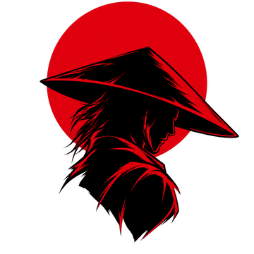
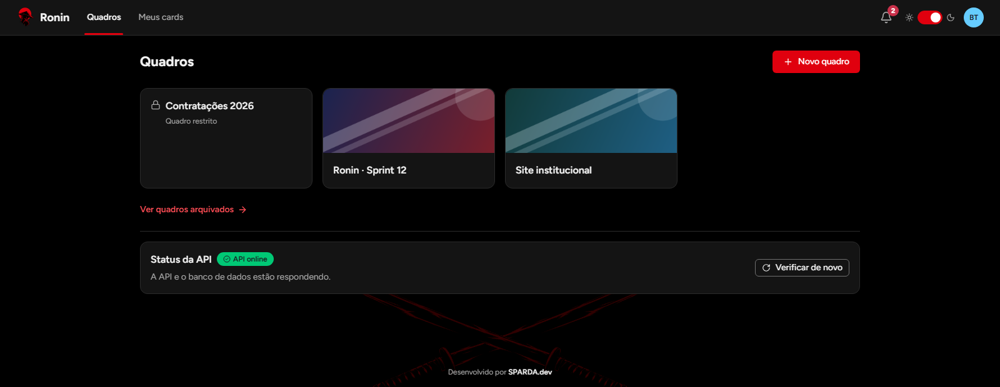

<p align="center">
  
</p>

<h1 align="center">Ronin</h1>

<p align="center"><strong>Hub de ferramentas para equipes pequenas de software, com dados no seu próprio servidor. A primeira ferramenta é um Kanban colorido, rápido e acessível.</strong></p>

<p align="center">
  <a href="https://github.com/raphasparda/Ronin-front/actions/workflows/ci.yml"></a>
  
  
  
  
</p>

<p align="center">
  
  
  
  
  
  
  
  
  
</p>

> **English summary.** Ronin is a self-hosted tool hub for small software teams. This repository is the web client (React 19, TypeScript, Vite, TanStack Query, Tailwind CSS 4) of its first tool, a Kanban board. Highlights: drag-and-drop with a keyboard-friendly "Move to…" alternative, optimistic updates with per-item rollback and mutation queues, board covers uploaded straight from the browser to object storage, restricted boards shown as a padlocked tile to people without access, filters stored in the URL, safe Markdown, light and dark themes, page transitions with the View Transitions API, and WCAG 2.2 AA checks with axe in the end-to-end suite. The API, database and shared Zod contracts live in a separate repository.

O Ronin nasceu de um problema concreto: ferramentas SaaS de quadros guardam os dados de terceiros e carregam funções que uma equipe de cinco pessoas nunca usa. Este repositório tem a **SPA em React**, já organizada em plataforma (acesso, equipe, notificações) e ferramentas, começando pelo **Kanban**. A API, o banco e o pacote de contratos ficam em um repositório separado.

Instância publicada: <https://ronin-web.onrender.com> (plano gratuito do Render; a primeira visita pode demorar enquanto o serviço acorda).

## Sumário

- [Telas](#-telas)
- [Funcionalidades](#-funcionalidades)
- [Destaques técnicos](#-destaques-técnicos)
- [Arquitetura](#-arquitetura)
- [Stack](#-stack)
- [Qualidade](#-qualidade)
- [Documentação](#-documentação)
- [Roadmap](#-roadmap)
- [Autor](#-autor)

## 🖼️ Telas

Capturas do próprio app, rodando com dados de exemplo.

<p align="center">
  
  <br /><sub>Quadro no tema escuro, com a capa no topo e listas coloridas.</sub>
</p>

<p align="center">
  
  <br /><sub>O mesmo quadro no tema claro: etiquetas, prioridade, prazo com estado e responsáveis, tudo legível de relance.</sub>
</p>

<p align="center">
  
  <br /><sub>Lista de quadros: capa nos tiles e cadeado no quadro restrito.</sub>
</p>

<table>
  <tr>
    <td width="50%" align="center">
      
      <br /><sub>Detalhe do card: descrição, checklist, responsáveis, prazo e etiquetas.</sub>
    </td>
    <td width="50%" align="center">
      
      <br /><sub>Meus cards: tudo que é seu, em todos os quadros, por urgência.</sub>
    </td>
  </tr>
  <tr>
    <td width="50%" align="center">
      
      <br /><sub>Login: sem cadastro público, só por convite.</sub>
    </td>
    <td width="50%" align="center">
      
      <br /><sub>Celular: layout responsivo e navegação inferior.</sub>
    </td>
  </tr>
</table>

## ✨ Funcionalidades

**Plataforma**

- **Configuração inicial:** a primeira pessoa cria a equipe e vira Admin. Não existe cadastro público.
- **Convites e redefinição de senha por link**, gerados pelo Admin, sem depender de e-mail.
- **Administração de membros:** papel, desativar, reativar e anonimizar conta (LGPD).
- **Perfil** com nome, senha e foto, recortada e comprimida no navegador antes do envio.
- **Notificações no app** quando alguém atribui você a um card ou comenta num card seu.
- **Tema claro e escuro** com as cores da marca, aplicado antes da primeira pintura, sem piscar.

**Kanban**

- **Quadros e listas coloridas** com paleta fixa, e uma lista marcada como "Concluído".
- **Capa do quadro:** imagem reduzida no navegador e enviada direto para o armazenamento, com barra de progresso.
- **Quadros restritos:** visível para a equipe ou só para uma lista de pessoas. Quem está fora vê um cadeado e o texto "Quadro restrito"; quem administra vê tudo.
- **Arrastar e soltar** listas, cards e itens de checklist, com atualização otimista e rollback em erro.
- **"Mover para…"** como alternativa completa ao arraste, pelo teclado e no celular.
- **Detalhe do card** com URL própria: descrição em Markdown seguro, responsáveis, etiquetas, prazo com estado, prioridade, checklists, comentários e histórico.
- **Filtros na URL** por responsável, etiqueta, prioridade, prazo e texto, compartilháveis por link.
- **Meus cards:** tudo que é seu, em todos os quadros, agrupado em Atrasados, Vencendo, Com prazo e Sem prazo.
- **Transições entre telas no estilo iOS** com a View Transitions API e animações em diálogos, menus e cards novos. "Reduzir movimento" desliga tudo.
- **Responsivo**, com navegação inferior no celular.

## 🔩 Destaques técnicos

- **Atualizações otimistas com rollback por item.** Mover, concluir ou editar um card aparece na hora. Se a API recusar, só os campos daquele card voltam, sem desfazer as outras ações em andamento. [cards-api.ts](src/features/tools/kanban/cards/cards-api.ts)
- **Filas de mutação por escopo.** Movimentos seguidos no mesmo quadro são enviados em ordem, e o quadro só é recarregado quando a fila esvazia.
- **Envio da capa fora do cliente de API.** O `PUT` vai para outra origem, com URL assinada pela API, sem cookie de sessão e sem header de CSRF. A imagem é redimensionada no navegador antes de subir, e tipo e tamanho são conferidos no cliente e de novo no servidor. [cover-upload.ts](src/lib/cover-upload.ts) · [image-resize.ts](src/lib/image-resize.ts)
- **Quadro bloqueado é um tipo, não um estado vazio.** A listagem vem do servidor como união discriminada, e o tile bloqueado não é link: é um botão focável que explica o motivo, com o cadeado sempre acompanhado de texto. [BoardsPage.tsx](src/features/tools/kanban/boards/BoardsPage.tsx)
- **Perder o acesso com o quadro aberto é um caso tratado.** Um `403` numa mutação avisa, recarrega o quadro e cai na tela de sem acesso. [board-errors.ts](src/features/tools/kanban/boards/board-errors.ts)
- **Contratos compartilhados.** Tipos e schemas Zod vêm do mesmo pacote que a API usa, e os testes de componentes usam MSW com as mesmas fixtures.
- **Design system tokenizado no Tailwind 4.** Tokens semânticos e de paleta por tema, sem cores literais nos componentes. [globals.css](src/styles/globals.css) · [design-system.md](docs/design/design-system.md)
- **Segurança no cliente.** O redirecionamento pós-login aceita só caminhos internos, o Markdown renderiza sem HTML cru e sem links `javascript:`, e toda mutação envia o header de CSRF que a API exige. [safe-next.ts](src/lib/safe-next.ts) · [Markdown.tsx](src/components/ui/Markdown.tsx)
- **Acessibilidade medida, não prometida.** Alvo WCAG 2.2 AA, nenhuma informação só por cor, caminho completo por teclado e verificação com axe nos dois temas dentro do E2E. [a11y-screens.spec.ts](e2e/a11y-screens.spec.ts) · [MoveCardDialog.tsx](src/features/tools/kanban/cards/MoveCardDialog.tsx)
- **Transições de página** calculadas pela profundidade da rota, sobre o `viewTransition` do React Router. [page-transitions.ts](src/lib/page-transitions.ts)

## 🧭 Arquitetura

O código separa o que **toda ferramenta usa** do que é **de uma ferramenta**, para as próximas entrarem sem mexer na plataforma.

```text
src/features/
  platform/        auth, admin, perfil, notificações, usuários
  tools/kanban/    quadros, cards, meus cards
src/components/    ui (Button, Dialog, Menu, Toast, Markdown...) e layout (cabeçalho, navegação)
src/lib/           cliente de API, TanStack Query, tema, datas, transições
```

Em produção, SPA e API ficam na mesma origem: o front é um Static Site no Render com rewrite de `/api/*` para a API, sem CORS. Os dados atualizam ao voltar para a aba, depois de cada ação e por polling, sem tempo real por decisão.

## 🧱 Stack

| Camada      | Tecnologia                                                            |
| ----------- | --------------------------------------------------------------------- |
| UI          | React 19, TypeScript 5.9 em modo `strict`, React Router, lucide-react |
| Build       | Vite 8                                                                |
| Estilo      | Tailwind CSS 4 com tokens próprios, fonte Figtree                     |
| Dados       | TanStack Query 5, contratos Zod 4 compartilhados com a API            |
| Formulários | React Hook Form                                                       |
| Arraste     | dnd-kit                                                               |
| Markdown    | react-markdown com remark-gfm, sem HTML                               |
| Testes      | Vitest, Testing Library, MSW, Playwright com axe-core                 |
| Qualidade   | ESLint (typescript-eslint, type-checked), Prettier, GitHub Actions    |
| Publicação  | Render Static Site, rewrite de `/api/*`, CSP estrita                  |

## ✅ Qualidade

Medido em 18/09/2026:

| Suíte                                     | Testes | Resultado                      |
| ----------------------------------------- | -----: | ------------------------------ |
| Componentes e páginas (Vitest + MSW)      |    312 | ✅                             |
| E2E Playwright com axe, desktop e celular |     56 | ✅ 53 · 3 pulados por viewport |

A CI roda lint, typecheck, testes de componentes e build, e depois o E2E com a API real em job separado, a cada pull request.

## 📚 Documentação

| Documento                                                    | Conteúdo                                              |
| ------------------------------------------------------------ | ----------------------------------------------------- |
| [docs/design/design-system.md](docs/design/design-system.md) | cores, tokens, temas e componentes                    |
| [docs/design/screens.md](docs/design/screens.md)             | telas e fluxos                                        |
| [docs/ops/setup-local.md](docs/ops/setup-local.md)           | ambiente de desenvolvimento, para quem for contribuir |
| [docs/ops/deploy-render.md](docs/ops/deploy-render.md)       | publicação no Render                                  |
| [CHANGELOG.md](CHANGELOG.md)                                 | histórico de versões                                  |

O escopo do produto, o contrato da API e as decisões de arquitetura ficam no repositório da API.

## 🗺️ Roadmap

- **1.0.0:** produção em servidor próprio com Docker, Caddy e backup criptografado fora da VPS.
- **Hub:** registro de ferramentas que alimenta o menu e a home, notificações genéricas por ferramenta.
- **Próximas ferramentas** entram em `features/tools/<nome>` sem tocar na plataforma.

## 👤 Autor

**Raphael Sparda** · SPARDA.dev · [github.com/raphasparda](https://github.com/raphasparda)
